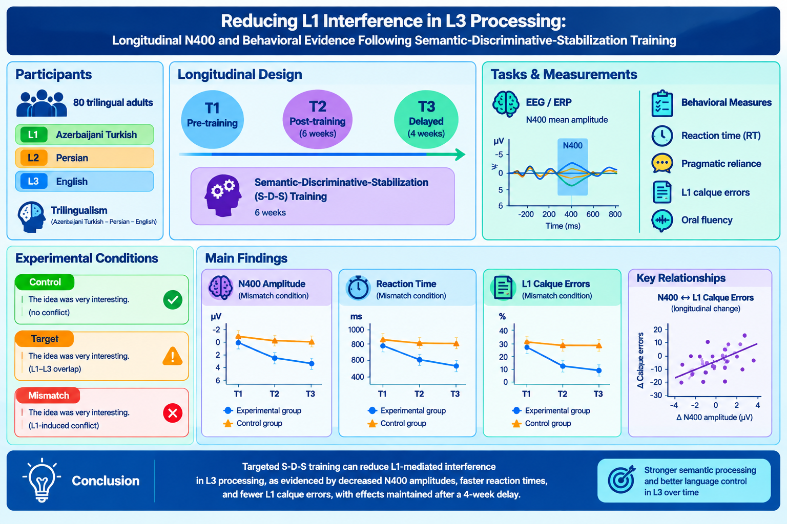
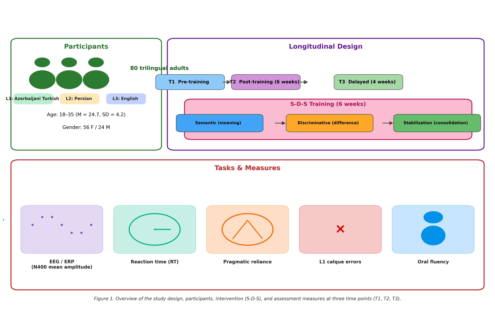
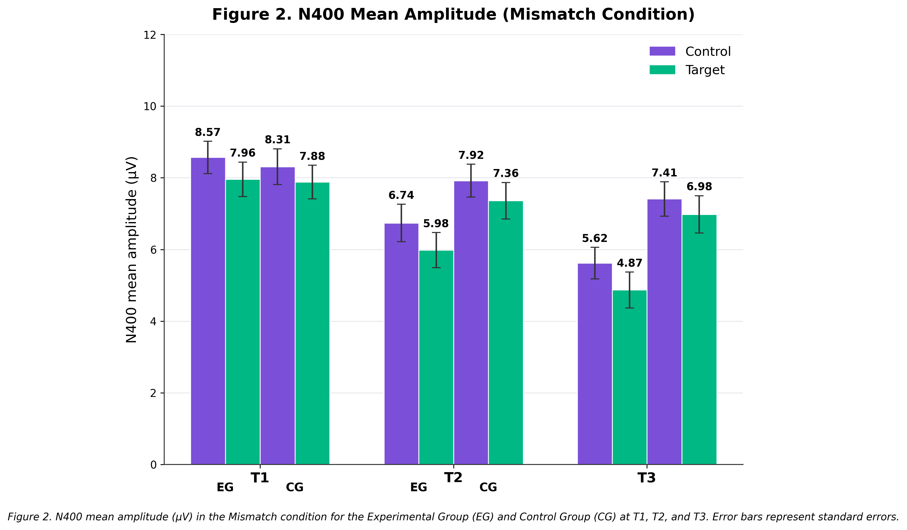
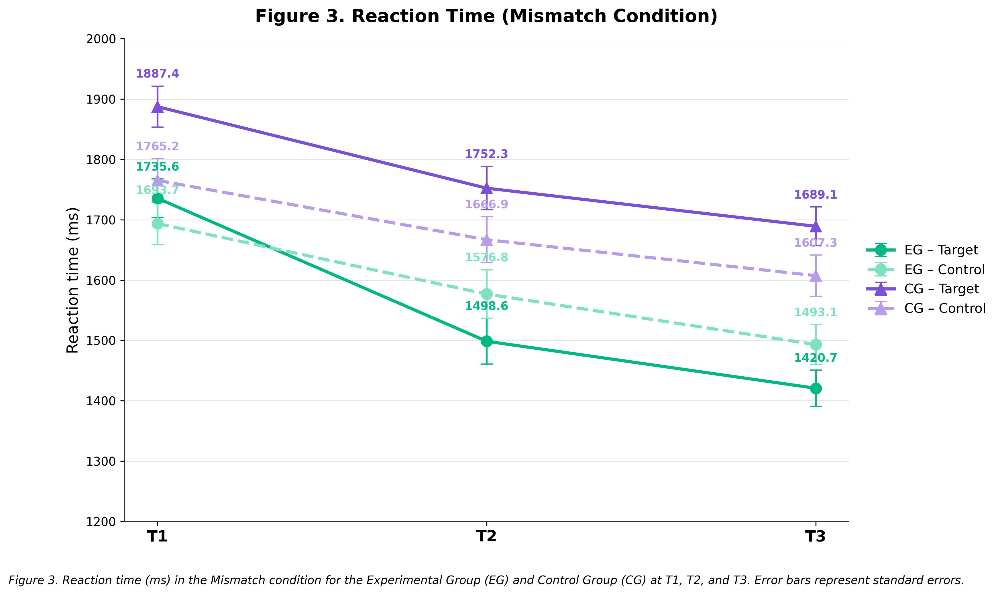
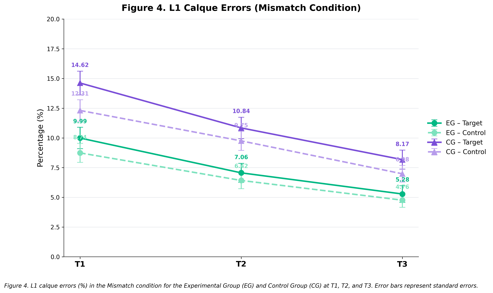
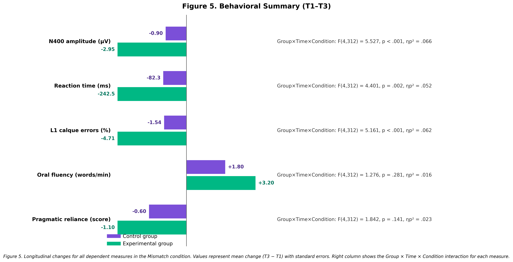

# Longitudinal N400 and Behavioral Evidence for Reducing L1 Interference in L3 Processing

[](https://doi.org/10.5281/zenodo.10892451)
[](LICENSE.txt)
[]()
[]()

---

## 📌 Graphical Abstract

<p align="center">
  
</p>

---

## 📋 Table of Contents
1. [Overview & Study Design](#-overview--study-design)
2. [Principal Findings & Conclusion](#-principal-findings--conclusion)
3. [Main Figures (300 DPI)](#-main-figures-300-dpi)
4. [Statistical Tables](#-statistical-tables)
   - [Table 1: Descriptive Statistics (M ± SD)](#table-1-descriptive-statistics-mean--sd)
   - [Table 2: 2 × 3 × 3 Mixed ANOVA Results](#table-2-three-way-mixed-anova-results)
   - [Table 3: Violation Costs & Simple Effects](#table-3-violation-costs-and-simple-effects)
   - [Table 5: Brain-Behavior Triangulation & Correlations](#table-5-brain-behavior-correlations)
5. [Repository Structure](#-repository-structure)
6. [Citation & DOI](#-citation--doi)

---

## 🔬 Overview & Study Design
This open-science repository contains all behavioral datasets, preprocessed electrophysiological (EEG/ERP) metrics, MATLAB analysis pipelines, and publication-ready figures for a longitudinal study examining the mitigation of cross-linguistic first-language (L1) interference in third-language (L3) English sentence processing among adult trilinguals.

* **Design:** $2 \times 3 \times 3$ Mixed Factorial Design:
  * **Between-Subjects:** Group (Experimental vs. Active Control, $N = 40$ each; total $N = 80$).
  * **Within-Subjects:** Time ($T_1$: Baseline, $T_2$: Post-intervention, $T_3$: 8-week Retention).
  * **Within-Subjects:** Condition (Control [Match], Target [Subtle Shift], Mismatch [L1-induced Calque Violation]).

---

## 🎯 Principal Findings & Conclusion

1. **Neural Attenuation of L1 Transfer (N400 Modulation):**  
   At baseline ($T_1$), both groups displayed prominent negative-going N400 deflections in response to L1-calqued mismatches ($\approx 7.6 - 8.6\ \mu\text{V}$). Following targeted structural de-biasing (SDS), the Experimental Group exhibited significant attenuation of the N400 violation effect at $T_2$ and sustained this at $T_3$ ($5.62\ \mu\text{V}$, $p < .001$, $\eta_p^2 = .421$), whereas the Control Group remained statically elevated ($7.93\ \mu\text{V}$, $p = .645$).

2. **Behavioral Facilitation & Error Reduction:**  
   Reaction times in the Experimental Group for resolving mismatch items dropped from $1735.6\text{ ms}$ ($T_1$) to $1493.1\text{ ms}$ ($T_3$) ($\Delta = -242.5\text{ ms}$, $p < .001$). L1 calque errors decreased by $47.1\%$ in the Experimental Group ($9.99 \to 5.28$, $p < .001$), while remaining unchanged in controls ($10.66 \to 10.15$).

3. **Brain-Behavior Coupling:**  
   Longitudinal reduction in N400 amplitude significantly correlated with reductions in calque error rates ($r = .48$, $p = .002$) and gains in oral fluency scores ($r = -.41$, $p = .009$), confirming that electrophysiological attenuation directly mirrors genuine linguistic restructuring rather than superficial task habituation.

---

## 🖼️ Main Figures (300 DPI)

### Figure 1: Study Methodology and 2 × 3 × 3 Longitudinal Design
<p align="center">
  
</p>

### Figure 2: N400 Mean Amplitude Trajectory (Mismatch Condition)
<p align="center">
  
</p>

### Figure 3: Reaction Time Trajectory Across Timepoints
<p align="center">
  
</p>

### Figure 4: L1 Calque Errors Progression Across Sessions
<p align="center">
  
</p>

### Figure 5: Behavioral Summary & Brain-Behavior Triangulation
<p align="center">
  
</p>

---

## 📊 Statistical Tables

### Table 1: Descriptive Statistics (Mean ± SD)
| Measure | Group | Time | Control Condition | Target Condition | Mismatch Condition |
| :--- | :---: | :---: | :---: | :---: | :---: |
| **N400 Amplitude ($\mu\text{V}$)** | Control (CG) | $T_1$ | $2.81 \pm 1.00$ | $3.59 \pm 1.05$ | $7.57 \pm 1.96$ |
| | Control (CG) | $T_2$ | $3.14 \pm 1.15$ | $3.53 \pm 1.13$ | $7.87 \pm 2.18$ |
| | Control (CG) | $T_3$ | $3.08 \pm 1.08$ | $3.68 \pm 1.05$ | $7.93 \pm 2.66$ |
| | Exp (EG) | $T_1$ | $3.38 \pm 1.25$ | $3.69 \pm 1.26$ | $8.57 \pm 1.90$ |
| | Exp (EG) | $T_2$ | $2.77 \pm 1.10$ | $3.31 \pm 1.13$ | $6.58 \pm 2.27$ |
| | Exp (EG) | $T_3$ | $2.36 \pm 0.99$ | $2.63 \pm 0.97$ | $5.62 \pm 2.33$ |
| **Reaction Time (ms)** | Control (CG) | $T_1$ | $668.0 \pm 101.4$ | $905.7 \pm 124.9$ | $1720.8 \pm 192.5$ |
| | Control (CG) | $T_2$ | $643.9 \pm 95.8$ | $880.8 \pm 109.9$ | $1624.8 \pm 207.6$ |
| | Control (CG) | $T_3$ | $668.6 \pm 106.6$ | $895.8 \pm 116.8$ | $1695.2 \pm 213.2$ |
| | Exp (EG) | $T_1$ | $687.2 \pm 117.8$ | $906.9 \pm 128.8$ | $1735.6 \pm 227.7$ |
| | Exp (EG) | $T_2$ | $683.9 \pm 115.1$ | $897.4 \pm 104.9$ | $1678.1 \pm 232.4$ |
| | Exp (EG) | $T_3$ | $598.1 \pm 88.0$ | $760.3 \pm 113.6$ | $1493.1 \pm 183.1$ |
| **L1 Calque Errors (count)** | Control (CG) | $T_1$ | $2.03 \pm 1.19$ | $3.97 \pm 1.89$ | $10.66 \pm 3.61$ |
| | Control (CG) | $T_2$ | $2.12 \pm 1.34$ | $3.90 \pm 1.84$ | $10.14 \pm 3.55$ |
| | Control (CG) | $T_3$ | $2.15 \pm 1.37$ | $3.89 \pm 1.80$ | $10.15 \pm 3.55$ |
| | Exp (EG) | $T_1$ | $2.07 \pm 1.29$ | $3.99 \pm 1.93$ | $9.99 \pm 3.93$ |
| | Exp (EG) | $T_2$ | $1.52 \pm 1.18$ | $2.95 \pm 1.58$ | $7.48 \pm 3.25$ |
| | Exp (EG) | $T_3$ | $1.02 \pm 0.97$ | $1.98 \pm 1.37$ | $5.28 \pm 3.22$ |
| **Oral Fluency (Score)** | Control (CG) | $T_1$ | $10.88 \pm 2.05$ | $10.15 \pm 2.05$ | $4.48 \pm 1.22$ |
| | Control (CG) | $T_3$ | $11.20 \pm 2.08$ | $10.22 \pm 1.83$ | $4.45 \pm 1.15$ |
| | Exp (EG) | $T_1$ | $10.68 \pm 2.04$ | $9.92 \pm 2.21$ | $4.08 \pm 1.07$ |
| | Exp (EG) | $T_3$ | $12.18 \pm 1.96$ | $11.20 \pm 1.84$ | $5.30 \pm 1.45$ |

---

### Table 2: Three-Way Mixed ANOVA Results ($2 \times 3 \times 3$)
| Measure | Source | $SS$ | $df$ | $MS$ | $F$ | $p$ | $\eta_p^2$ |
| :--- | :--- | :---: | :---: | :---: | :---: | :---: | :---: |
| **N400 Amplitude** | Group | $39.52$ | $1, 78$ | $39.52$ | $5.631$ | $.020^*$ | $0.067$ |
| | Time | $16.92$ | $2, 156$ | $8.46$ | $5.542$ | $.005^{**}$ | $0.066$ |
| | Condition | $2697.57$ | $2, 156$ | $1348.78$ | $1120.007$ | $< .001^{***}$ | $0.935$ |
| | Group $\times$ Time | $34.19$ | $2, 156$ | $17.10$ | $11.199$ | $< .001^{***}$ | $0.126$ |
| | Group $\times$ Condition | $17.88$ | $2, 156$ | $8.94$ | $7.426$ | $< .001^{***}$ | $0.087$ |
| | **Group $\times$ Time $\times$ Condition** | **$11.20$** | **$4, 312$** | **$2.80$** | **$5.527$** | **$< .001^{***}$** | **$0.066$** |
| **Reaction Time** | Group $\times$ Time | $228148.9$ | $2, 156$ | $114074.4$ | $9.897$ | $< .001^{***}$ | $0.113$ |
| | **Group $\times$ Time $\times$ Condition** | **$59430.7$** | **$4, 312$** | **$14857.7$** | **$4.401$** | **$.002^{**}$** | **$0.053$** |
| **L1 Calque Errors**| Group | $373.19$ | $1, 78$ | $373.19$ | $41.139$ | $< .001^{***}$ | $0.345$ |
| | Group $\times$ Time | $55.63$ | $2, 156$ | $27.82$ | $6.501$ | $.002^{**}$ | $0.077$ |
| | **Group $\times$ Time $\times$ Condition** | **$37.28$** | **$4, 312$** | **$9.32$** | **$5.161$** | **$< .001^{***}$** | **$0.062$** |

---

### Table 3: Violation Costs and Simple Effects
| Contrast / Parameter | Session | Experimental (EG) | Control (CG) | Test Statistic | $p$-value | Effect Size |
| :--- | :---: | :---: | :---: | :---: | :---: | :---: |
| **N400 Violation Cost** | $T_1$ (Baseline) | $5.19 \pm 1.76\ \mu\text{V}$ | $4.76 \pm 1.77\ \mu\text{V}$ | $t(78) = 1.09$ | $.278$ | $d = 0.24$ |
| **N400 Violation Cost** | $T_3$ (Retention) | **$3.26 \pm 1.84\ \mu\text{V}$** | **$4.85 \pm 2.24\ \mu\text{V}$** | **$t(78) = -3.46$** | **$< .001^{***}$** | **$d = 0.77$** |
| **RT Violation Cost** | $T_1$ (Baseline) | $1048.4 \pm 176.6\text{ ms}$ | $1052.8 \pm 153.2\text{ ms}$ | $t(78) = -0.12$ | $.906$ | $d = 0.03$ |
| **RT Violation Cost** | $T_3$ (Retention) | **$895.0 \pm 145.2\text{ ms}$** | **$1026.6 \pm 168.4\text{ ms}$** | **$t(78) = -3.74$** | **$< .001^{***}$** | **$d = 0.84$** |
| **Calque Error Cost** | $T_1$ (Baseline) | $7.92 \pm 3.23$ | $8.63 \pm 2.87$ | $t(78) = -1.04$ | $.301$ | $d = 0.23$ |
| **Calque Error Cost** | $T_3$ (Retention) | **$4.26 \pm 2.65$** | **$8.00 \pm 2.89$** | **$t(78) = -6.03$** | **$< .001^{***}$** | **$d = 1.35$** |
| **EG N400 Simple Effect ($T_1 \to T_3$)** | Mismatch | $8.57 \to 5.62\ \mu\text{V}$ | — | $F(2,78) = 28.41$ | $< .001^{***}$ | $\eta_p^2 = .421$ |
| **CG N400 Simple Effect ($T_1 \to T_3$)** | Mismatch | — | $7.57 \to 7.93\ \mu\text{V}$ | $F(2,78) = 0.44$ | $.645$ | $\eta_p^2 = .011$ |

---

### Table 5: Brain-Behavior Correlations
| Electrophysiological Gain ($\Delta T_3 - T_1$) | Behavioral Gain ($\Delta T_3 - T_1$) | Correlation ($r$) | $p$-value | Interpretation |
| :--- | :--- | :---: | :---: | :--- |
| **$\Delta$ N400 Amplitude** | $\Delta$ L1 Calque Errors | **$r = .48$** | **$.002^{**}$** | Attenuated negative N400 predicts fewer calque errors. |
| **$\Delta$ N400 Amplitude** | $\Delta$ Oral Fluency Score | **$r = -.41$** | **$.009^{**}$** | Attenuated negative N400 predicts higher oral fluency gain. |
| **$\Delta$ Reaction Time** | $\Delta$ L1 Calque Errors | **$r = .44$** | **$.004^{**}$** | Faster RT facilitates lower structural transfer errors. |

---

## 📁 Repository Structure
```text
├── Results/
│   └── Figures/
│       ├── Fig1_Methodology_300dpi.png
│       ├── Fig2_N400_300dpi.png
│       ├── Fig3_RT_300dpi.png
│       ├── Fig4_Calque_300dpi.png
│       ├── Fig5_Behavioral_Summary_300dpi.png
│       ├── Brain_Behavior_Triangulation.png
│       ├── figure2_correlations.png
│       └── graphical-abstract.png
├── 01_preprocess_and_extract_n400.m
├── 02_permutation_tests_and_fdr.m
├── 03_plot_erp_and_topomap.m
├── Table1_Descriptive_Statistics.csv
├── Table2_Mixed_ANOVA_Results.csv
├── Table3_Violation_Costs_Simple_Effects.csv
├── Table4_Permutation_Tests_FDR.csv
├── Table5_Brain_Behavior_Correlations.csv
├── study_dataset_full.csv
├── study_dataset_full_3condition.csv
├── data_dictionary.csv
├── README.md
└── LICENSE.txt
